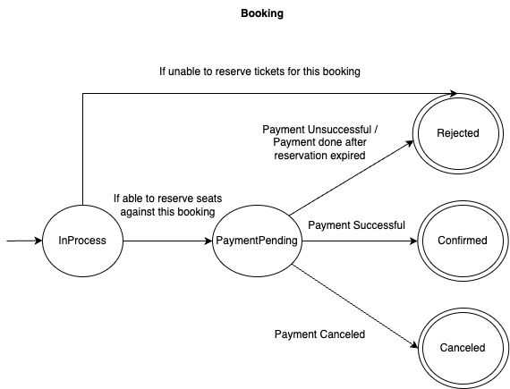
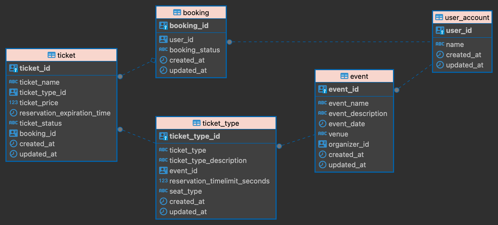
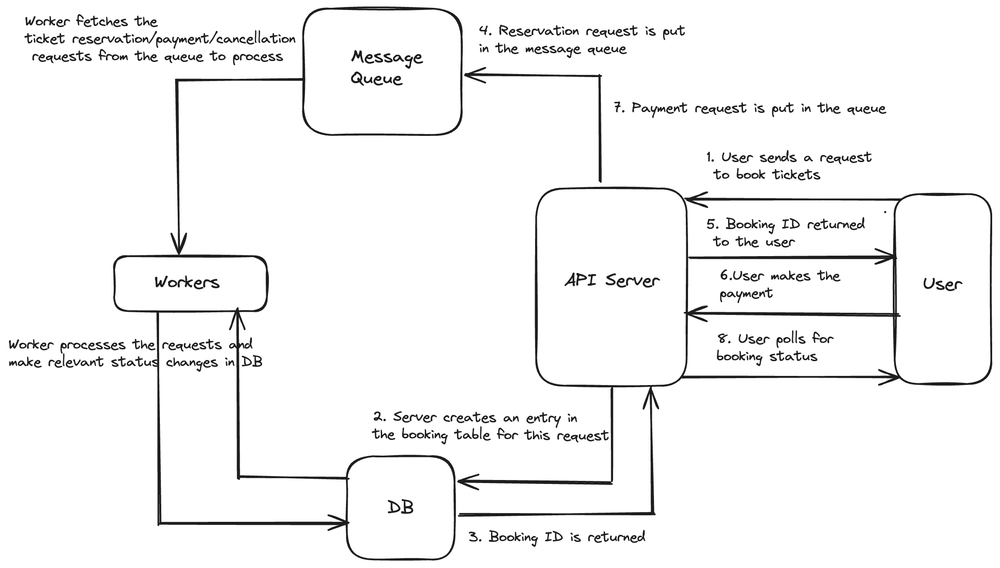

# swift-ticketing

A ticket booking system as a hobby project for onboarding that is supposed to scale for large volume of incoming requests.

## System Architecture

### User flow
1. User selects an event to book the tickets
2. User selects the ticket they want to book
3. User is shown seats layout to choose preferred seats (applicable only for seated tickets)
4. Selected tickets are locked for some time and marked as `Reserved` for user to finish payment.
5. User can either proceed with the payment or cancel
6. If payment is successful and the reservation is still valid, ticket is marked as `Booked`. Otherwise it is marked as `Available` for others to book.

**Ticket States**

### Booking Process
1. When the user hits the endpoint to reserve a ticket, API server creates an entry in the `booking` table and returns the `booking_id` to the user. It also adds the reservation request to the queue. A background worker works on this queue and creates the required reservation.
2. User polls for the `booking_status` using the `booking_id` returned. If the status changes from `InProcess` to `PaymentPending`, user proceeds with the payment flow.
3. User can either finish the payment successfully or cancel the request. If payment is successful, we mark Booking as `Confirmed` or else `Rejected`. The ticket status for the confirmed booking changes to `Booked`. For unsuccessful booking ticket status changes to `Available`.

 **Booking States**

### DB

### App Workflow

#### Workers
Workers wait for the messages in queue to process requests. There are 3 types of requests - `RESERVE`, `BOOK`, `CANCEL` 
##### Reserve
Worker tries to lock the tickets that user wants to book. This is done using `SELECT .. FOR UPDATE` (skip locked). If the worker is able to lock these tickets, statuses of these tickets are changed to `RESERVED` and their `reservation_expiration_time` is updated to `current_time + reservation_timelimit_seconds (this can be fetched from ticket_type table)`. Status of `booking` is changed from `InProcess` to `PaymentPending`. 
If worker is not able to lock the tickets, booking status is set to `Rejected`.
##### Book
After payment is successful, request is put by the API server in the queue to update the booking status to `Confirmed` and ticket_status to `Booked`.
##### Cancel
If user cancels the payment, request is put in queue to update the the booking status to `Canceled` and ticket status to `Available`.
